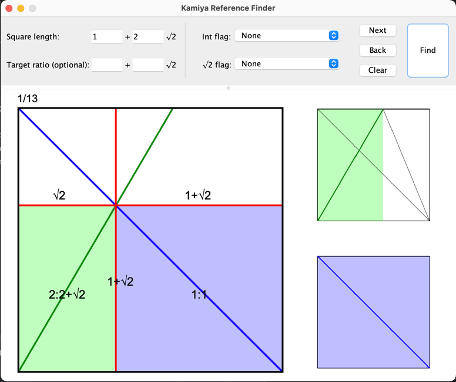

# Standalone Kamiya Reference Finding Tool
_This project is an attempt to port an existing reference finding tool created by **Satoshi Kamiya** as a non-browser Java application. You can find the original link [here](https://www.folders.jp/reference/reference.html)._

# Requirement
idk yet lol im dumb

# Usage
### Inputs
Inputs involve **square length**, in form of __ + __√2, is the total ratio of the square. It's a required argument for the bot to perform calculations. Simple fill in your integers (example: **1** + **2**√2)

An optional **target ratio**, same format as above, is for specifying which reference containing such ratio to show first. **(Currently broken)**

### Flags
Flags can filter out certain results with some preset combinations of negative coefficients. Consider `a` and `b` as coefficients of `a` + `b`√2.

There are two main flags:

- **Integer flag** allows:
  - None: all results
  - Allow -int on an axis: results with no negative `a` on both axes
  - No -int: only results with positive `a`
- **√2 flag** allows:
    - None: all results
    - Allow -√2 on an axis: results with no negative `b` on both axes
    - No -√2: only results with positive `b`

### Result outputs
When the inputs are all set and valid, click **Find** to calculate results.

Once the results are calculated, the first one will show up by default. to cycle through all results, click **Next** and **Back** (or **<-** and **->** respectively).

If you want to clear the results to empty, click **Clear**.

# TODO List:
- [ ] Fix preferred ratio not being taken into results' orderings ***(IMPORTANT)***
- [x] Implement the flags *(mostly works but not completely for some reason)*
- [x] Show the current result index somewhere
- [x] Clear results to empty the panel *(Optional)*
- [ ] Dynamically draw reference images base on decimal and direction instead of just finding and slapping resource images *(Optional but super cool and difficult)*